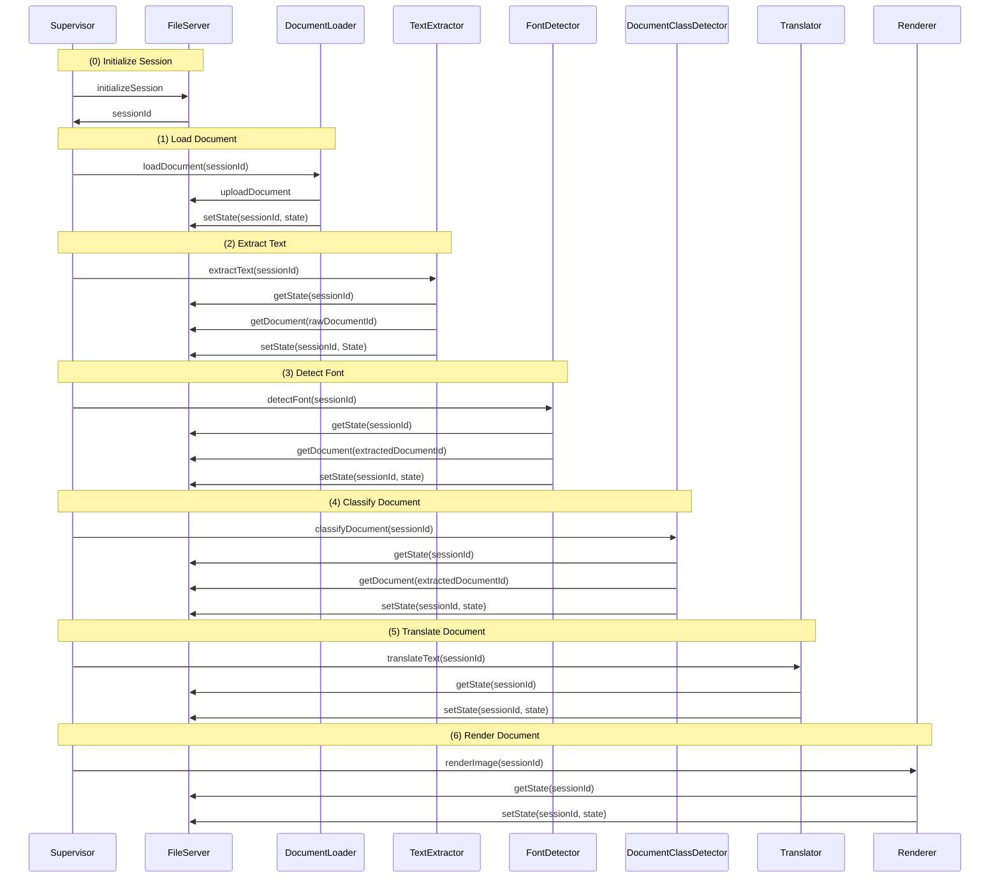

# trÄnslenzor

## Prerequisites

- [uv](https://docs.astral.sh/uv/install/) - Fast Python package installer (required)
- [Docker](https://docs.docker.com/get-docker/) - For running Ollama (required)
- Internet connection - Required for initial setup to download Ollama models

## Quick Start

1. **Clone the repository**
   ```sh
   git clone https://github.com/luroess/traenslenzor.git
   cd traenslenzor
   ```

2. **Install Python dependencies**
   ```sh
   uv sync
   ```

3. **Start Ollama server**
   ```sh
   docker compose up -d
   ```
   
   This will start the Ollama server in the background. The first run will download the Ollama image.

4. **Run the application**
   ```sh
   uv run python -m traenslenzor
   ```
   
   On first run, the application will:
   - Connect to the Ollama server
   - Download the `llama3.2` base model (requires internet connection)
   - Create a custom model for translation
   - Start the document assistant interface

## Setup (for Development)

After cloning, install python dependencies:

```sh
uv sync
```

Install pre-commit hooks:

```sh
uv run pre-commit install
```

## Troubleshooting

### "Ollama server not running" error

Make sure Docker is running and start the Ollama server:
```sh
docker compose up -d
```

Check if Ollama is running:
```sh
curl http://localhost:11434
# Should return: "Ollama is running"
```

### Model download fails

If you're behind a proxy or have network issues, you can manually pull the model:
```sh
docker exec ollama ollama pull llama3.2
```

### Stop the Ollama server

When you're done, you can stop the Ollama server:
```sh
docker compose down
```

## Running only the supervisor

```sh
uv run python -m traenslenzor.supervisor.supervisor
```

## Interface Definition
The individual components are called with a sessionId. This session id is used to retrieve a global shared state from the fileserver upon which is operated.




### State Definition Template

```ts
interface State {
    rawDocumentId: string;
    extractedDocument: {
        id: string,
        documentCoordinates: [];
    }
    renderedDocumentId: string,
    text: TextItem[];
    language: string,

}

interface TextItem {
    extractedText: string;
    confidence: number;
    // 1st point upper left corner
    // 2nd point upper right corner
    // 3st point lower right corner
    // 4st point lower left corner
    bbox: {x: number, y: number}[];
    detectedFont: string;
    translatedText: string;
}
```


