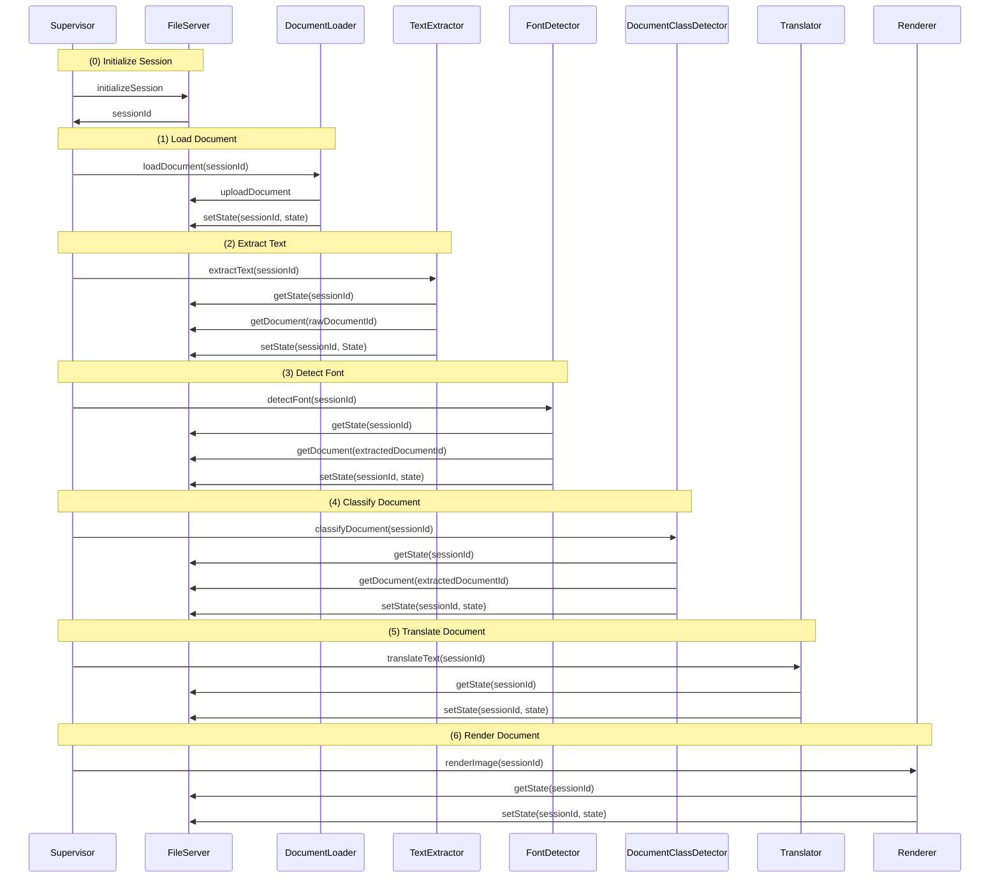

# trÄnslenzor

## Prerequisites

- [uv](https://docs.astral.sh/uv/install/) - Fast Python package installer (required)

## Run Project

```sh
uv run python -m traenslenzor
```

## Setup (for Development)

After cloning, install python dependencies

```sh
uv sync
```

install pre-commit hooks:

```sh
uv run pre-commit install
```

## Running only the supervisor

```sh
uv run python -m traenslenzor.supervisor.supervisor
```

## Interface Definition
The individual components are called with a sessionId. This session id is used to retrieve a global shared state from the fileserver upon which is operated.




### State Definition Template

```ts
interface State {
    rawDocumentId: string;
    deskewBackend?: "opencv" | "uvdoc";
    extractedDocument: {
        id: string,
        documentCoordinates: [];
        mapXYId?: string,
        mapXYShape?: [number, number, number],
        backend?: "opencv" | "uvdoc",
    }
    renderedDocumentId: string,
    text: TextItem[];
    language: string,

}

interface TextItem {
    extractedText: string;
    confidence: number;
    // 1st point upper left corner
    // 2nd point upper right corner
    // 3st point lower right corner
    // 4st point lower left corner
    bbox: {x: number, y: number}[];
    detectedFont: string;
    translatedText: string;
}
```
